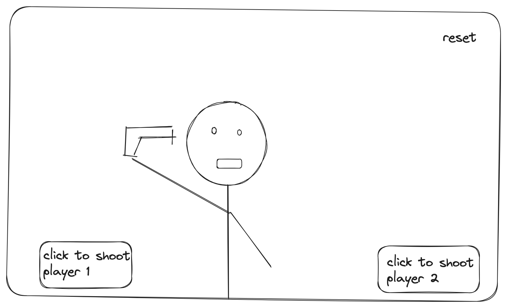
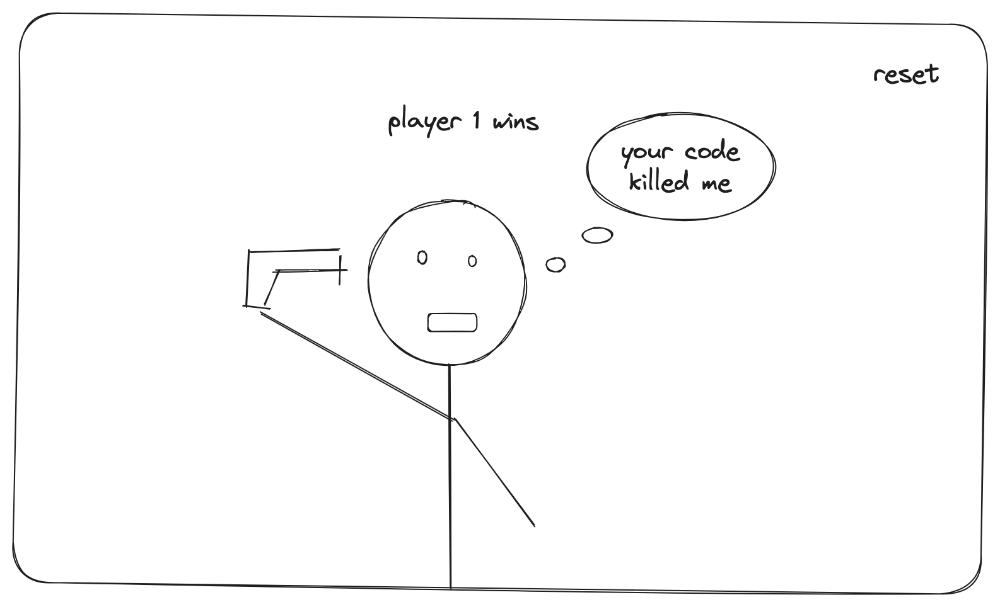

# Project Proposal Example

## Project Choice (Tell us which project you're doing!)

Russian Roulette

## Project Description 

My game is called Russian Roulette it's a game where a gun will be loaded with 1 bullet in a revolver and the cylinder would spin and youll have a 16% chance of dying. The game will be able to be played by 2 players and the person that dies first loses.

## Wire Frames

**Initial Landing View**


**Results View**


# russian-roulette


## Pseudo Code
```
1) Let's set up the game:
   totalChambers = 6
   currentChamber
   playerAlive = true

2) Now, we want to create a function to pick a random chamber:
   FUNCTION randomlySelectChamber(totalChambers):
       RETURN randomNumber(1, totalChambers)

3) Next, we'll create a function to take turns:
   FUNCTION takeTurn():
       // This function will include steps 4 and 5

4) In each turn, we spin the revolver to randomize the chamber:
   FUNCTION spinRevolver():
       currentChamber = randomlySelectChamber(totalChambers)

5) After spinning, we pull the trigger and check the result:
   FUNCTION pullTrigger():
       IF currentChamber is the loaded chamber:
           playerAlive = false
           OUTPUT "Bang! You are dead."
       ELSE:
           OUTPUT "Click! You survived. Spin the chamber again."

// Now, let's start the game
WHILE playerAlive:
    takeTurn()

// The game is over
OUTPUT "Game Over."

  
```

## User Stories

#### MVP Goals

-As a player i would want to know when it'll be my turn.
-As a player i would want to know when I lose.
-As a player i would want there to be a way i could restart the game when it ends.

#### Stretch Goals

-As a player i would want to see a losing animation.
-As a player i would want audio of the gun being shot with a bullet and without a bullet and when the mag is getting spun.
-As a player i would want an animation of 2 cowboys aiming at each other with guns in there hand to give me a better experience when playing the game.
-As a player i would want to make a bet for playing the game to make it more interesting.

#### Notionboard Template
Notionboard template for building projects ( You can use this for any project )
https://www.notion.so/GA-Unit-3-Tunr-Lab-da2c82fafd4e4a7aa654676732db9ee3

#### Timeline - Daily Accountability
Example of a Timeline to keep organized and on task for hitting goals every single day you’re on the sprint for your project.

Create your own table using this markdown table generator website:
https://www.tablesgenerator.com/markdown_tables

Do not neglect to plan, you will thank yourself later for being proactive!
| Day        |   | Task                               | Blockers | Notes/ Thoughts |
|------------|---|------------------------------------|----------|-----------------|
| Thursday   |    | Create and present proposal        |          |                 |
| Friday     |    | Create html, js, css files         |          |                 |
| Saturday   |    | follow my pseudo code and see where i get from there
          |       |                |
| Sunday     |    | make sure my game is functionable               |          |                 |
| Monday     |    | Add styling to make it look family friendly.                       |          |                 |
| Tuesday    |    | Finalize MVP                      |          |                 |
| Wedenesday |    | Work on stretch goals and get them all done           |          |                 |
| Thursday   |    | Work on icebox items if applicable (face pictures)|          |                 |
| Friday     |    | Presentation Day!                  |          |                 |
|            |    |                                    |          |                 |